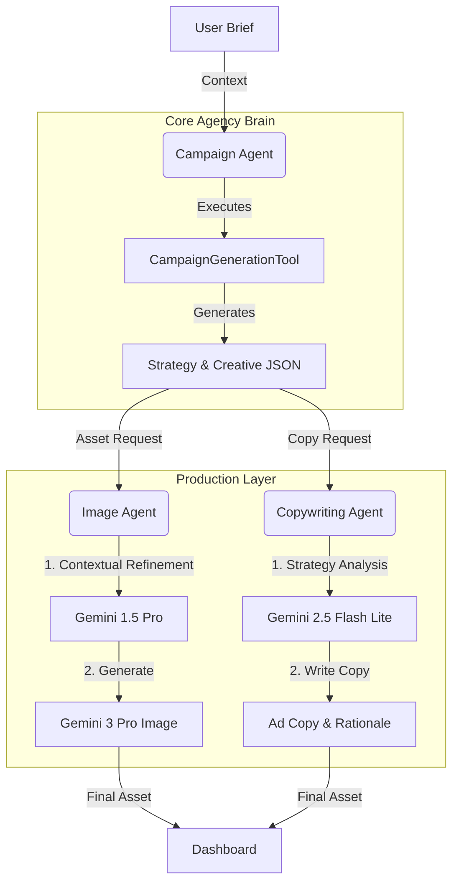

# AdGenie - Autonomous Multi-Agent Ad Campaign Generator

**AdGenie** is a next-generation creative automation platform powered by **Google's Gemini 3 Pro** and **Gemini 2.5 Flash**. It simulates a full-service creative agency (Strategist, Copywriter, Photographer) to generate high-fidelity marketing assets from a simple product brief.

---

##  Judge's Guide: Gemini 3 API Usage

This project explicitly leverages the latest capabilities of the Gemini ecosystem:

| Feature | Model Used | Why? |
| :--- | :--- | :--- |
| **High-Fidelity Assets** | **`gemini-3-pro-image-preview`** | Used for generating commercial-grade product photography with standard aspect ratios. |
| **Strategic Reasoning** | **`gemini-2.5-flash-lite`** | Powers the **Campaign** and **Copywriting Agents**. Selected for its high speed and strong reasoning capabilities for JSON structure enforcement. |
| **Multimodal Copywriting** | **`gemini-2.5-flash-lite`** | The Copywriting Agent *sees* the generated image before writing copy, ensuring the text matches the visual mood and composition (e.g., finding negative space). |

---

##  System Architecture: Agent-to-Agent (A2A) Framework

The core of AdGenie is built on a custom **Agent-to-Agent (A2A)** framework located in `src/lib/a2a`. Unlike simple prompt chains, these Agents are autonomous entities that use **Tools** to perform complex tasks.

### The "Agency" Workflow

1.  **User Input** (BriefForm) → 2. **Campaign Agent** (Strategy) → 3. **Specialized Agents** (Execution)



---

##  Key Features

### 1. Holistic Campaign Strategy
*   **Deep Persona Analysis**: Generates detailed target personas with demographics, psychographics, and buying behaviors.
*   **Strategic Insights**: Identifies pain points, emotional hooks, and content pillars.
*   **Effective Font Recommendation**: Analyzes the brand vibe and persona to recommend a specific typography style (e.g., "Bold Sans-Serif" for high-impact tech, "Elegant Script" for luxury).

### 2. Intelligent Visual Generation
*   **Gemini 3 Pro Powered**: Leveraging the latest image generation capabilities for photorealistic results.
*   **Contextual Prompt Refinement**: The **Image Agent** acts as a Creative Director, rewriting the prompt to include:
    *   **Lighting & Mood**: Translates emotions into lighting cues (e.g., "Warm Golden Hour" for trust).
    *   **Camera Specs**: Adds technical details like lens type (85mm, Macro) and sensor size.
*   **Smart Aspect Ratios**: Automatically adjusts the composition based on the placement:
    *   **IG/Facebook Feed**: 4:5 Vertical.
    *   **Stories/Reels/TikTok**: 9:16 Full Vertical.
    *   **LinkedIn/Twitter**: 1:1 Square.

### 3. Integrated Text Embedding
*   **Direct Text-to-Image**: Users can embed custom text directly into the generated images using Gemini's text rendering capabilities.
*   **Seamless UI**: A dedicated input allows for rapid iteration of text overlays (e.g., "SALE", "LIMITED TIME") that are physically rendered into the scene.

### 4. Conversion-Focused Copywriting
*   **Psychological Hooks**: The **Copywriting Agent** uses the generated strategy (Pain Points, Emotional Hook) to write persuasive headlines and body copy.
*   **Visual Synergy**: It analyzes the generated image (or prompt) to ensure the copy complements the visual elements.

---

##  Tech Stack (Bleeding Edge)

*   **Framework**: **Next.js 16** (App Router)
*   **Library**: **React 19**
*   **Styling**: Tailwind CSS v4 + Framer Motion
*   **AI SDK**: Google Generative AI SDK for Node.js
*   **Language**: TypeScript

---

##  Core Agents (`src/lib/agents`)

### 1. The Campaign Agent (`campaign-agent.ts`)
*   **Role**: Creative Director & Strategist.
*   **Function**: Orchestrates the entire campaign, generating the "Big Idea," strategy, and initial creative concepts.

### 2. The Image Agent (`image-agent.ts`)
*   **Role**: Professional Commercial Photographer.
*   **Function**: Generates high-fidelity product photography. Handles the logic for `aspectRatio` enforcement and prompt engineering.

### 3. The Copywriting Agent (`copywriting-agent.ts`)
*   **Role**: Senior Copywriter.
*   **Function**: Writes headlines, body copy, and CTAs. It is "multimodal-aware," meaning it understands the context of the visual asset it is writing for.

---

##  Getting Started

1.  **Environment Setup**:
    ```bash
    cp .env.example .env.local
    # Fill in GEMINI_API_KEY
    ```

2.  **Install Dependencies**:
    ```bash
    npm install
    ```

3.  **Run Development Server**:
    ```bash
    npm run dev
    ```

---

*Built for the Google Gemini Hackathon 2026.*
